# Annado

A clean task manager for macOS and Windows that lives on your Obsidian vault, or markdown files. No proprietary database, no lock-in, it's all based on your own files. Designed with Obsidian in mind, but also works as a stand-alone app or on your folder with markdown files.

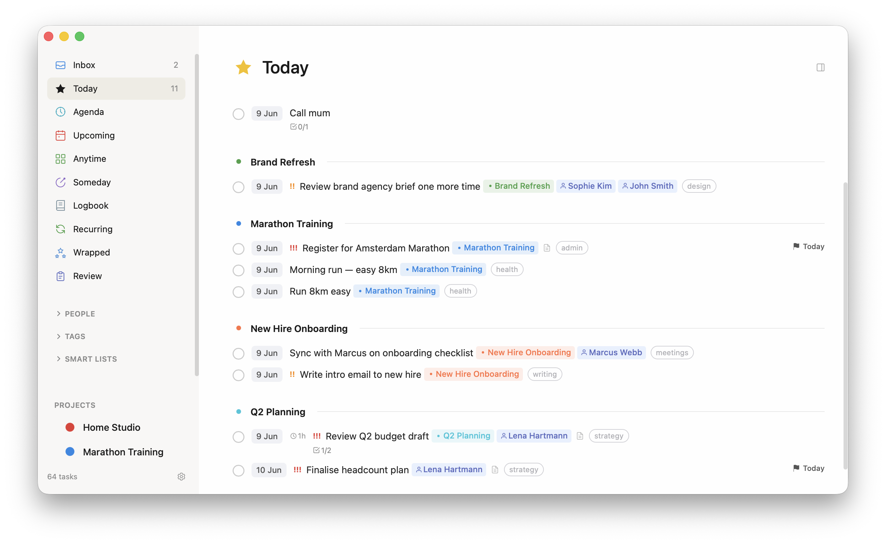

## The Idea

Your tasks stay as plain markdown in your Obsidian vault. Annado reads and writes standard checkbox syntax with inline metadata, giving you a polished native desktop UI while your data stays portable. Open the same vault in Obsidian and your tasks are right there.

Bilingual: supports Dutch and English for natural language date input.

## Platform Support

- **macOS**: original supported desktop runtime. The native Calendar integration uses macOS Calendar/EventKit and remains macOS-only.
- **Windows**: core Markdown task workflows have been verified on a Windows debug build, including first-run vault selection, vault scan, Quick Add, Quick Find, edit/delete/complete persistence, side panel, Agenda drag scheduling, restart persistence, notifications, tray behavior, and deep-link routing. Windows Calendar integration is currently unsupported and disabled with an in-app message.
- **Linux**: not currently claimed as a verified runtime.

The current Windows smoke artifact is the unsigned NSIS debug installer at
`src-tauri/target/debug/bundle/nsis/Annado_0.1.2_x64-setup.exe`. Smoke evidence is recorded in
`.project/projects/annado-windows-compatible/artifacts/windows-core-workflow-smoke3-result.txt`.
The installer is suitable for local/CI verification only until Windows signing is configured.

## How It Works

Annado treats your Obsidian vault as its database. It scans every `.md` file for markdown checkboxes marked with `#task`, parses inline annotations like `@when(...)`, `@due(...)`, and `[[WikiLinks]]`, and presents them in a task manager UI. Every edit you make in Annado is written straight back to the markdown files — no syncing, no export step, no sidecar database.

See it in action — capturing a task in an Obsidian daily note during a meeting, then editing it in Annado:


https://github.com/user-attachments/assets/343a7135-a676-4ebd-99f5-dae0626fe181


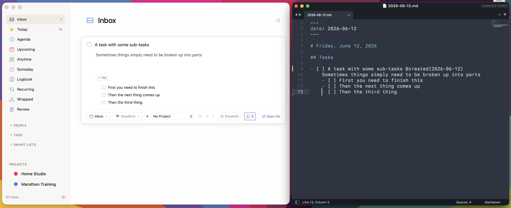

---

## Views

Annado has 12 views, each accessible from the sidebar or via keyboard shortcut:

| View | Shortcut (macOS / Windows) | What's in it |
|---|---|---|
| **Inbox** | `Cmd+1` / `Ctrl+1` | Unscheduled tasks awaiting processing |
| **Today** | `Cmd+2` / `Ctrl+2` | Tasks scheduled for today |
| **Agenda** | `Cmd+3` / `Ctrl+3` | Day/week timeline with drag-to-schedule |
| **Upcoming** | `Cmd+4` / `Ctrl+4` | Tasks scheduled for future dates |
| **Anytime** | `Cmd+5` / `Ctrl+5` | Flexible-time tasks with no specific date |
| **Someday** | `Cmd+6` / `Ctrl+6` | Backlog and long-term tasks |
| **Logbook** | `Cmd+7` / `Ctrl+7` | Completed tasks history |
| **Recurring** | `Cmd+8` / `Ctrl+8` | Recurring task templates and instances |
| **Wrapped** | `Cmd+9` / `Ctrl+9` | Spotify Wrapped-style year-in-review |
| **Added Today** | `Cmd+0` / `Ctrl+0` | Tasks created today |
| **Review** | `Cmd+R` / `Ctrl+R` | Guided 5-step weekly review workflow |
| **Smart Lists** | sidebar | Custom-filtered task collections |

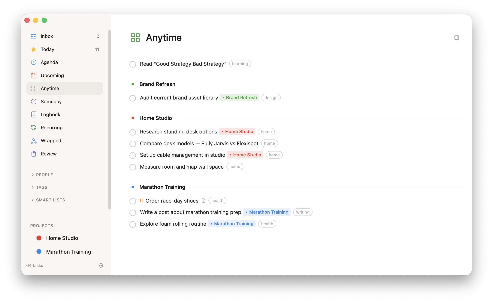

More screenshots of every view and panel: **[visual tour](docs/tour.md)**.

---

## Task Syntax

Annado reads and writes this inline markdown format:

```markdown
- [ ] Task title @when(tomorrow) @time(09:00) @duration(1h30m) [[Project]] !(1) #task #tag @due(2025-03-01)
    Notes go here, indented 4 spaces
    - [x] Checklist sub-item
```

By default, only top-level checkboxes with `#task` become Annado tasks. You can change the marker tag, or leave it blank to import every top-level checkbox, in Settings -> General -> Task Parsing.

| Field | Example | Description |
|---|---|---|
| `@when(...)` | `@when(tomorrow)` | Scheduled date |
| `@time(...)` | `@time(09:00)` | Scheduled time (used by Agenda) |
| `@duration(...)` | `@duration(1h30m)` | Estimated duration |
| `@due(...)` | `@due(2025-03-01)` | Deadline |
| `!(1-3)` | `!(1)` | Priority (1 = highest) |
| `#task` | `#task` | Default Annado task marker |
| `#tag` | `#work` | Tag |
| `[[WikiLink]]` | `[[Project Name]]` | Project or person link |
| `@recurring(id)` | `@recurring(abc123)` | Recurring template reference |
| `@created(date)` | `@created(2025-02-14)` | Creation date |
| `@completed(date)` | `@completed(2025-02-16)` | Completion date |

Annado also reads Obsidian Tasks emoji fields: scheduled `⏳ YYYY-MM-DD`, start `🛫 YYYY-MM-DD`, due `📅 YYYY-MM-DD`, created `➕ YYYY-MM-DD`, done `✅ YYYY-MM-DD`, cancelled `❌ YYYY-MM-DD`, and priority `🔺` / `⏫` / `🔼` / `🔽` / `⏬`.

Checklist sub-items (`- [ ] sub-task`) under a task item can be toggled directly in Annado — the change persists to the markdown file. They do not need their own marker tag.

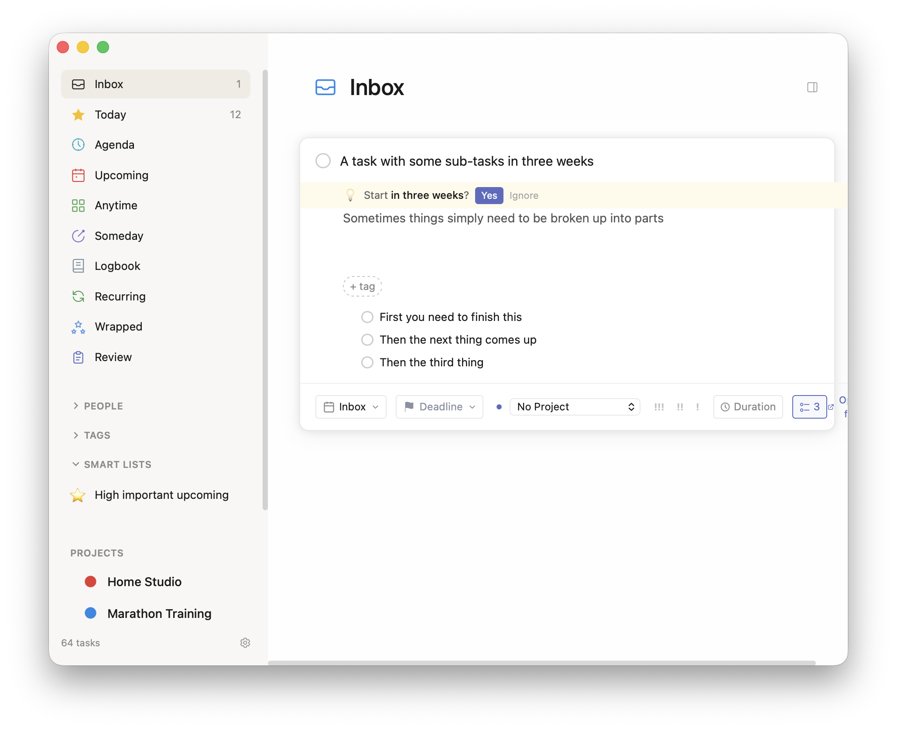

---

## Scheduling

### Natural Language Dates

Type dates in plain language in any date picker. Both English and Dutch are supported:

| Category | English | Dutch |
|---|---|---|
| Keywords | `today`, `tonight`, `tomorrow`, `anytime`, `someday` | `vandaag`, `vanavond`, `morgen`, `overmorgen`, `altijd`, `ooit` |
| Relative | `this weekend`, `next weekend`, `next week`, `next month`, `end of week`, `end of month` | `dit weekend`, `volgend weekend`, `volgende week`, `volgende maand`, `eind van de maand` |
| Weekdays | `friday`, `fri`, `next monday` | `vrijdag`, `vr`, `volgende maandag` |
| Offsets | `in 3 days`, `in three weeks`, `in a week` | `over 3 dagen`, `over twee weken`, `over een week` |
| Explicit | `2026-12-25`, `25/12`, `feb 14`, `march 15 2027` | `25-12`, `22 mei`, `15 maart 2027` |

Offsets accept digits or spelled-out numbers up to twelve. Partial dates roll forward: typing `22 mei` in June resolves to next year's May 22. While typing, the picker shows ranked suggestions, and quick-select chips (Today, Tomorrow, This Weekend, Next Week) are always one click away.

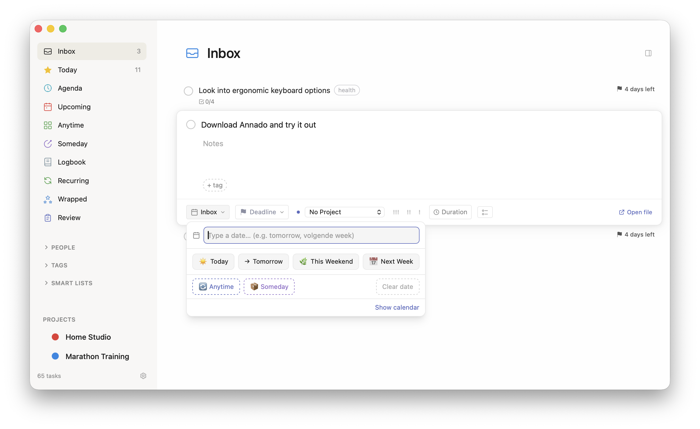

### Date Hints in Titles

Annado also spots dates in the task titles you type. Write "Call Lena friday" in Quick Add and a banner offers to schedule the task for Friday — accept it and the date is set with the title cleaned up to "Call Lena". Prefix the phrase with `by`, `due`, `before` (or `voor` / `uiterlijk` in Dutch) and it's offered as a deadline instead: "Submit taxes by tomorrow" → deadline tomorrow, title "Submit taxes".

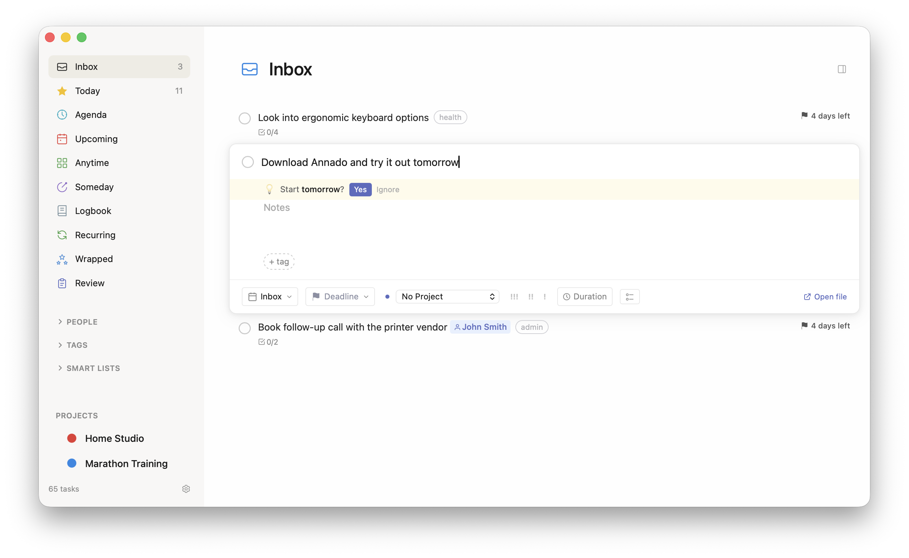

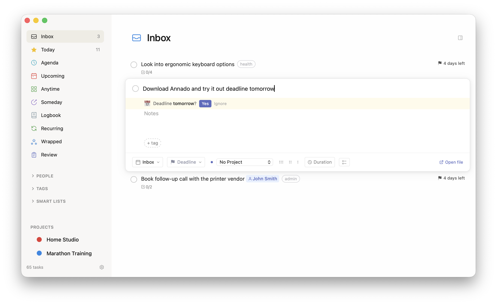

### When Values

The `@when(...)` field accepts:
- `inbox` — no schedule (appears in Inbox)
- `today` — scheduled for today
- `evening` — this evening
- `tomorrow` — scheduled for tomorrow
- `anytime` — flexible timing
- `someday` — backlog
- `YYYY-MM-DD` — specific date

### Deadlines

Tasks can have a separate deadline (`@due(...)`), independent of their scheduled date. Deadlines show countdown labels and urgency color-coding in the UI.

---

## Projects, People & Tags

### Projects

- Each `.md` file in your configured projects folder becomes a project.
- Nest folders to create hierarchy — child projects inherit the parent folder's color.
- Assign tasks via `[[Project Name]]` wiki-links.
- Project metadata (description, deadline, start date, ranking, related people, milestones) can be set in the file's YAML frontmatter.
- Projects are color-coded and drag-to-reorder in the sidebar.
- The sidebar shows task counts per project (toggleable in Settings).

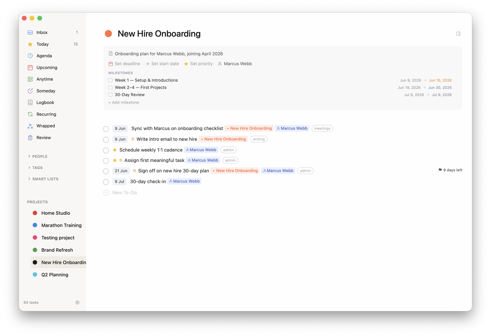

### Areas

If you prefer folder-based grouping over explicit links, configure an **Areas pattern** (Settings → Folder Paths). Tasks without a `[[Project]]` link are then grouped by the matching folder they live in.

### People

- Each `.md` file in your configured persons folder becomes a contact.
- Link tasks to people via `[[Person Name]]` wiki-links.
- Person metadata (organisation, relationship, languages) is read from YAML frontmatter.

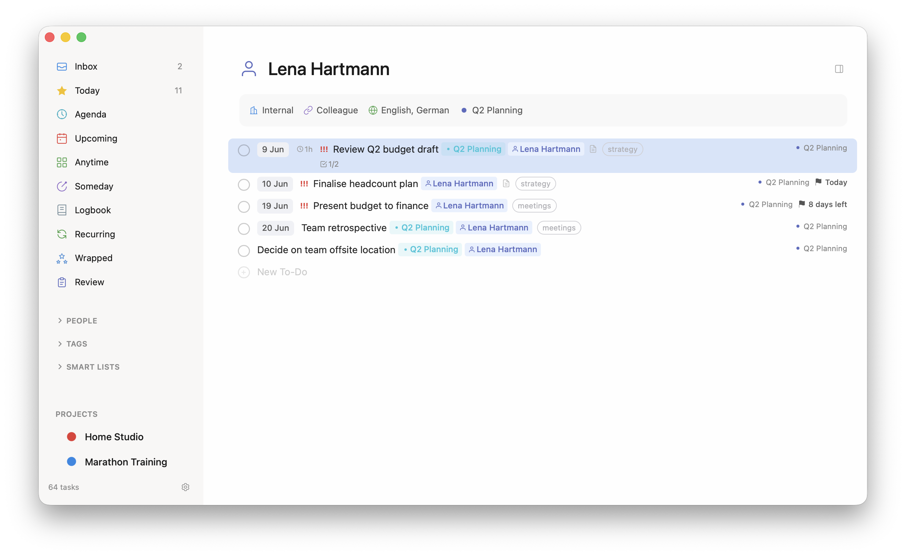

### Tags

- Add tags with `#tagname` in the task line.
- The configured task marker tag defaults to `#task` and is not shown as a normal tag.
- Tags are color-coded (colors persist per tag, customizable by right-clicking).
- Filter the current view by clicking a tag in the sidebar.

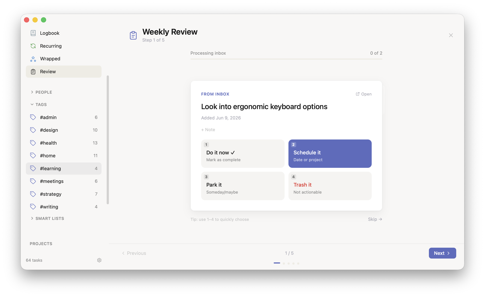

### Priority

Three levels: `!(1)` high · `!(2)` medium · `!(3)` low. Filter or create Smart Lists based on priority.

---

## Smart Lists

Smart Lists are saved custom filters, accessible from the sidebar with a custom emoji icon. Each Smart List can filter by any combination of:

- **View**: Inbox, Today, Upcoming, Anytime, or Someday
- **Priority**: High, Medium, or Low
- **Deadline**: has a deadline / no deadline
- **Due within**: N days / weeks / months
- **Projects**: one or more specific projects
- **Person**: a specific contact
- **Tag**: a specific tag
- **Age**: older than N days

Create a Smart List via the `+` button in the sidebar Smart Lists section. Right-click a Smart List to edit or delete it.

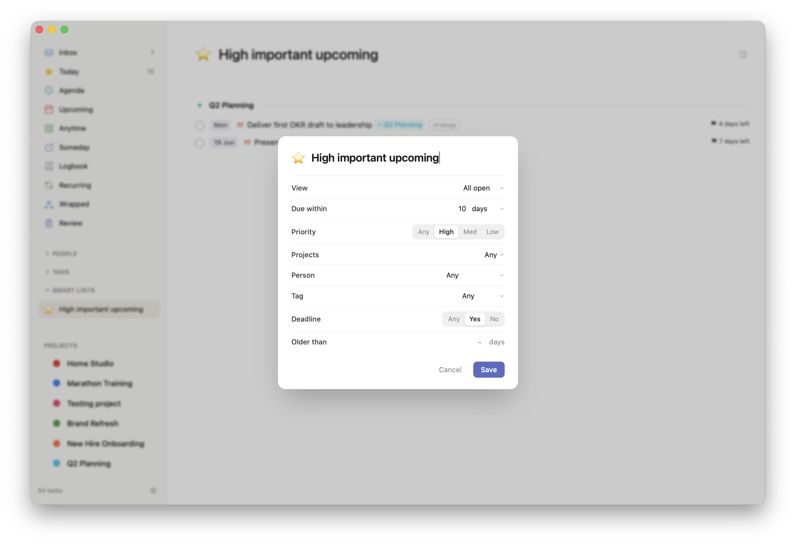

---

## Recurring Tasks

Recurring tasks are defined as template files in your configured recurring-templates folder. Each template specifies:

- **Title** and optional notes
- **Recurrence type**: Fixed interval (every N days/weeks/months/years) or After completion (reschedule N days after marking done)
- **Start date**, project, and priority

The **Recurring** view (`Cmd+8` on macOS, `Ctrl+8` on Windows) shows all templates. Click a template to see its pending instances. Instances are generated automatically from the template definition.

Create or edit templates via `Cmd+Shift+R` on macOS, `Ctrl+Shift+R` on Windows, or the `+` button in the Recurring view.


---

## Agenda

The Agenda view (`Cmd+3` on macOS, `Ctrl+3` on Windows) is a time-blocking timeline:

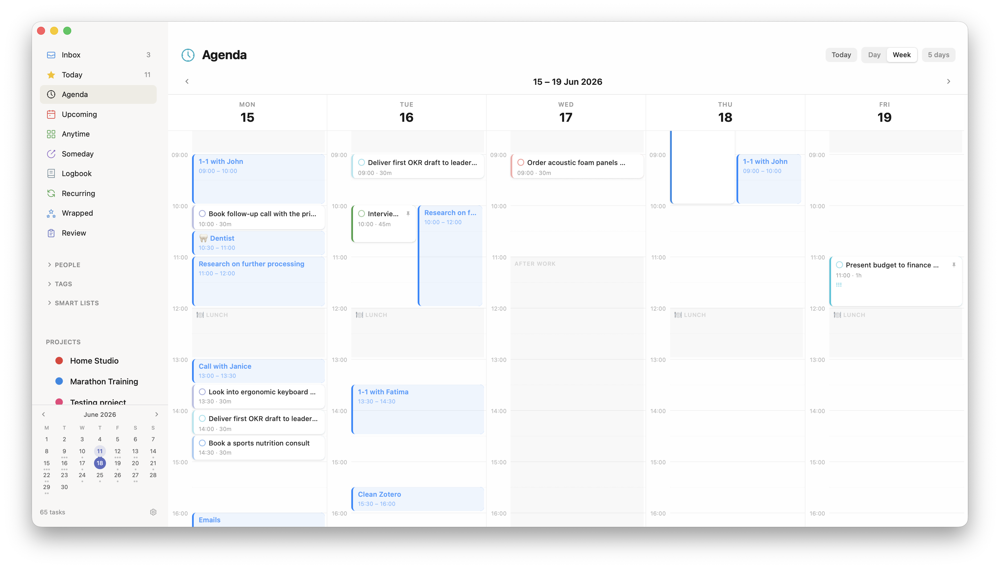

- **Day and Week** subviews (toggle in the top bar)
- **Current-time line** shows where you are in the day
- **Drag tasks** onto a time slot to schedule them at a specific time
- **Resize task blocks** to adjust duration
- **Unscheduled tasks panel** on the side — drag into the timeline or use Auto Schedule
- **Auto-scheduling**: places unscheduled tasks into available gaps respecting your work schedule, breaks, and blocking calendar events
- **Reschedule suggestions**: when you drag a task off its slot, Annado suggests the next 3 available slots across upcoming days
- **Calendar events** overlay inline on macOS (all-day events at the top, timed events in the timeline)
- **Calendar blocking** on macOS: mark specific calendars as "blocks auto-scheduling" in Settings so events are treated as busy time

Set a task's time with `@time(HH:MM)` or by dragging it to a slot. Set duration with `@duration(...)` or by resizing the block.

---

## Review

The Review workflow (`Cmd+R` on macOS, `Ctrl+R` on Windows) walks you through a structured 5-step weekly review:

1. **Process your inbox** — review and schedule unscheduled tasks
2. **Handle overdue tasks** — reschedule or complete tasks past their scheduled date
3. **Review stalled tasks** — tasks that haven't moved in a while
4. **Quiet projects** — projects with no recent activity
5. **Coming up next week** — a preview of what's scheduled next week

Each step shows a progress bar and task cards with inline actions (schedule, complete, delete, open in Obsidian). Use number keys `1–4` for quick actions within each step.

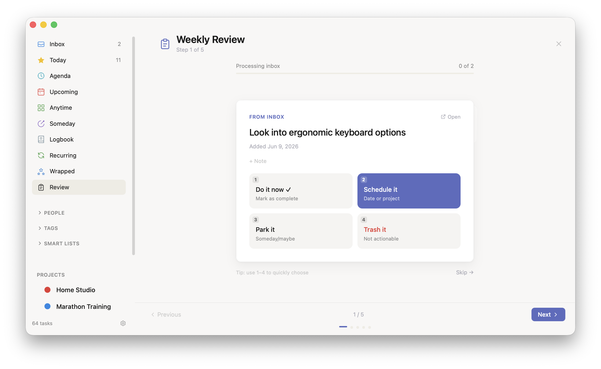

---

## Wrapped

The Wrapped view (`Cmd+9` on macOS, `Ctrl+9` on Windows) is a Spotify Wrapped-style year-in-review. Select a time period (week, month, or year) and step through a deck of animated slides (which ones appear depends on your data):

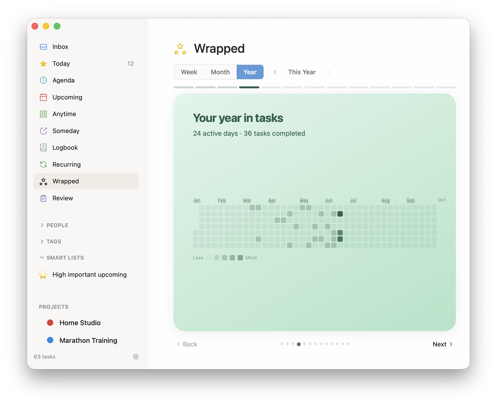

1. **Intro** — total completions with creation and completion rate stats
2. **Big Number** — your headline completion count with count-up animation
3. **Heatmap** — completion activity over time, GitHub-style
4. **Bar Chart** — completions by time period (week/month)
5. **Area Distribution** — how your work spread across folder areas
6. **Project Focus** — top projects by completions with momentum indicators
7. **Task Age** — how long it took you to complete tasks (buckets)
8. **Comparison** — this period vs the previous one
9. **Contrast** — longest task to complete vs oldest open task
10. **Personality** — your productivity personality type with supporting stats
11. **Look Ahead** — upcoming open tasks and key deadlines
12. **Outro** — summary with top projects

---

## Quick Add & Quick Find

### Quick Add (`Cmd+N` on macOS, `Ctrl+N` on Windows)

Rapid task capture from anywhere in the app. Respects the current view context (e.g., opening Quick Add in a project view pre-fills that project). Supports all inline annotations and date hints in titles.

**System-wide**: `Cmd+Shift+Space` on macOS, or `Ctrl+Alt+Space` on Windows, opens Quick Add even when Annado is in the background.

**Where new tasks land**: tasks created in Annado are appended to today's daily note, which is created automatically (with frontmatter and a `## Tasks` heading) if it doesn't exist yet. In an Obsidian vault, Annado reads your existing Daily Notes plugin settings to find the right folder and filename format; otherwise the folder and format configured in Settings → Folder Paths are used.

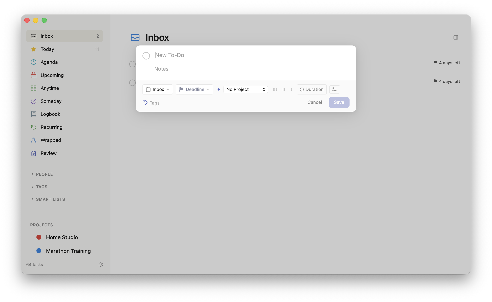

### Quick Find (`Cmd+F` on macOS, `Ctrl+F` on Windows, or type any letter)

Universal search across tasks, projects, people, views, and tags. Shows recent items when empty. Results update as you type.

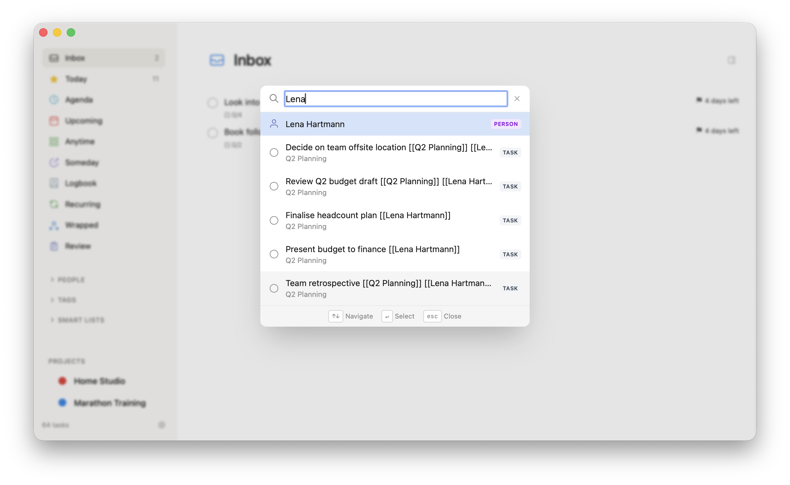

---

## Bulk Operations

Multi-select tasks with `Cmd+Click` on macOS, or `Ctrl+Click` on Windows. When multiple tasks are selected, a bulk-action toolbar appears at the bottom of the list:

- **Complete** all selected tasks
- **Delete** all selected tasks
- **Move to Project** — reassign all selected tasks
- **Change When** — reschedule all selected tasks
- **Change Deadline** — set deadline on all selected tasks
- **Change Priority** — set priority on all selected tasks

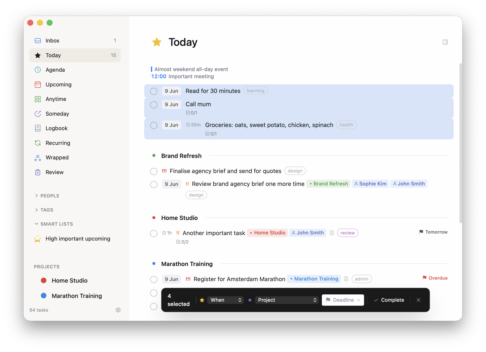

---

## Side Panel

Open a second, independent task view alongside the main view with `Cmd+\` on macOS, or `Ctrl+\` on Windows. The side panel:

- Has its own view selection, filtering, and task selection state
- Supports drag-and-drop **from** and **to** the main panel
- Is resizable by dragging the divider
- Remembers its width across sessions

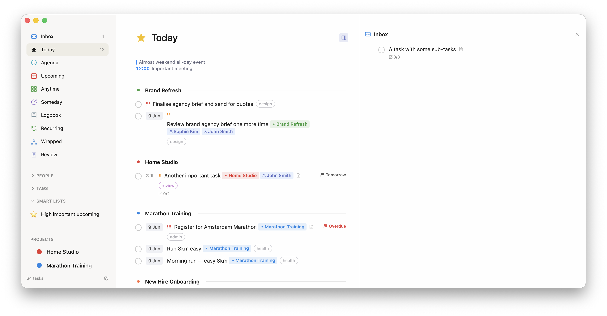

---

## Obsidian Integration

- **Jump to source**: click the Obsidian icon on any expanded task to open the source `.md` file at the exact line number in Obsidian
- **Live sync**: file changes made in Obsidian are reflected in Annado in real time (file watcher)
- **Wiki-links**: `[[Project]]` and `[[Person]]` links are parsed and rendered as navigation links in the UI
- **Vault detection**: Annado detects whether the folder is an Obsidian vault (`.obsidian/` present) and adapts — e.g., daily-note settings are read from Obsidian's own config
- **Pick your editor**: jump-to-source can open the system default, VS Code, Sublime, or a custom command instead of Obsidian (Settings → General)

---

## Deep Linking

Annado registers the `annado://` URL scheme for external capture from Shortcuts, Alfred, shell scripts, etc.:

```
annado://quickadd?title=Buy+groceries&notes=Milk,+eggs&when=tomorrow&project=Shopping
```

Supported parameters: `title`, `notes`, `when`, `project`.

---

## Keyboard Shortcuts

| Action | macOS | Windows |
|---|---|---|
| Quick Add | `Cmd+N` | `Ctrl+N` |
| Quick Find | `Cmd+F` | `Ctrl+F` |
| Open When date picker | `Cmd+S` | `Ctrl+Shift+S` |
| Open Deadline date picker | `Cmd+D` | `Ctrl+Shift+D` |
| Schedule to Today | `Cmd+T` | `Ctrl+Shift+T` |
| Toggle complete | `Cmd+K` | `Ctrl+Enter` |
| Delete task | `Cmd+Backspace` | `Ctrl+Shift+Backspace` |
| Move to Project | `Cmd+Shift+M` | `Ctrl+Shift+M` |
| New recurring template | `Cmd+Shift+R` | `Ctrl+Shift+R` |
| Toggle side panel | `Cmd+\` | `Ctrl+\` |
| Switch view: Inbox through Someday | `Cmd+1` - `Cmd+6` | `Ctrl+1` - `Ctrl+6` |
| Logbook | `Cmd+7` | `Ctrl+7` |
| Recurring | `Cmd+8` | `Ctrl+8` |
| Wrapped | `Cmd+9` | `Ctrl+9` |
| Added Today | `Cmd+0` | `Ctrl+0` |
| Review | `Cmd+R` | `Ctrl+R` |
| Open Settings | `Cmd+,` | `Ctrl+,` |
| Global Quick Add (system-wide) | `Cmd+Shift+Space` | `Ctrl+Alt+Space` |
| Show/focus app (system-wide) | `Cmd+Shift+A` | `Ctrl+Alt+A` |
| Navigate tasks down / up | `Ctrl+J` / `Ctrl+K` | `Ctrl+J` / `Ctrl+K` |
| Expand/collapse selected task | `Enter` | `Enter` |
| Close modal / deselect | `Escape` | `Escape` |
| Open Quick Find from typing | Type any letter | Type any letter |

Shortcuts marked *system-wide* work even when Annado is in the background. All customisable shortcuts can be rebound in **Settings → Keyboard Shortcuts**. Existing saved custom shortcuts remain valid.

---

## Notifications & Menu Bar

Annado can remind you about deadlines without you having the app in front of you:

- **Morning of deadline** — a reminder on the day itself (default 09:00)
- **Day before deadline** — a heads-up the evening before (default 18:00)
- **Overdue daily** — a daily nudge listing overdue tasks (default 08:00)
- **Launch banner** — a summary notification when the app starts

All notification types can be toggled individually, each with its own time, plus a master on/off switch and a test button (**Settings → Notifications**).

There's also a **menu bar icon** on macOS, or a **tray icon** on Windows, with a quick task panel and two system-wide shortcuts: `Cmd+Shift+Space` / `Cmd+Shift+A` on macOS, or `Ctrl+Alt+Space` / `Ctrl+Alt+A` on Windows.


---

## Excluded Files

Not every file in your vault should be scanned for tasks. There are two ways to exclude files:

**From Settings** (`Cmd+,` on macOS, `Ctrl+,` on Windows) → **Excluded Files & Folders**

Add paths relative to the vault root. A trailing `/` excludes an entire directory; otherwise it targets a single file.

```
Archive/                     ← skip everything under Archive
Templates/Meeting.md         ← skip one specific file
```

**Via frontmatter**

Any file with `annado_exclude: true` in its YAML frontmatter is silently skipped during scanning. Annado writes this automatically when you exclude a file through the UI, but you can also add it by hand:

```yaml
---
annado_exclude: true
---
```

---

## Settings

Open Settings with `Cmd+,` on macOS, or `Ctrl+,` on Windows. Five tabs:

### General

| Section | What you can configure |
|---|---|
| **Vault** | View or change the active vault location |
| **Appearance** | Theme — Light, Dark, or System; accent color |
| **Editor** | Where jump-to-source opens: System default, VS Code, Sublime, or a custom command |
| **Tasks** | Default task duration (15m–2h); confirm-before-delete toggle |
| **Sidebar Counts** | Show/hide task counts per view and per project section |
| **Excluded Files & Folders** | Manage the path exclusion list (see above) |
| **Folder Paths** | Project / person / areas / recurring-template folder patterns; daily notes folder and filename format |

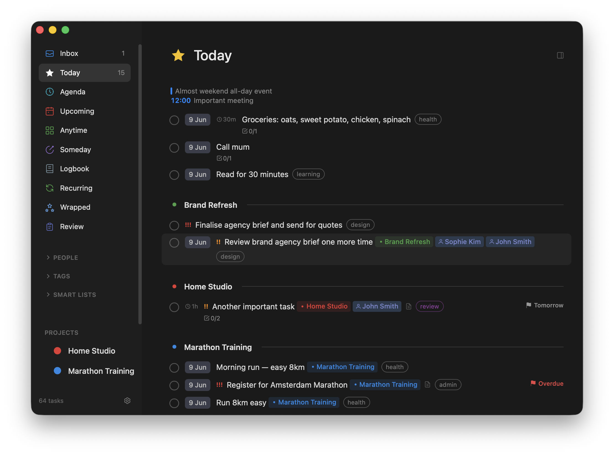

### Calendar

| Section | What you can configure |
|---|---|
| **Week** | Week start day (Monday or Sunday); show/hide weekends in Agenda |
| **Calendar** | Toggle macOS Calendar event display; per-calendar blocking toggle |
| **Schedule** | Work days (per day on/off), start/end times, and named breaks with per-weekday selection |

The work schedule drives Agenda auto-scheduling — tasks are only placed in open work hours, avoiding breaks and blocked calendar events. Calendar event import is macOS-only today; on Windows, Annado disables the Calendar integration and keeps task scheduling available without external calendar events.

### Shortcuts

View all fixed shortcuts and remap any customisable shortcut. Click a shortcut row, press your new key combination, and save.

### Notifications

| Section | What you can configure |
|---|---|
| **Menu bar / tray** | Show/hide the macOS menu bar or Windows tray icon |
| **Notifications** | Master on/off; morning-of, day-before, and overdue-daily reminders, each with its own time |
| **Launch banner** | Summary notification on app start |
| **Test** | Send a test notification |

### About

App info: version, links to the GitHub repository, issue tracker, and the visual tour.

---

## Vault Structure

Below is an example layout that works out of the box with the default folder patterns:

```
My Vault/
├── Projects/
│   ├── Work/
│   │   ├── Website Redesign.md    ← project with sub-folder hierarchy
│   │   └── Q1 Planning.md
│   └── Personal/
│       └── Home Renovation.md
├── Persons/
│   ├── Alice.md                   ← contact, frontmatter for metadata
│   └── Bob.md
├── Tasks.md                       ← tasks can live in any .md file
├── Daily Notes/
│   └── 2025-02-16.md              ← tasks here too
├── 12. System/
│   └── recurring-tasks/
│       └── Weekly Review.md       ← recurring task template
└── ...
```

Tasks can live in *any* markdown file in the vault — Annado scans them all (minus exclusions). The folder patterns are substring matches, so `Projects` matches `Projects/`, `01. Projects/`, `Work/Projects/`, etc.

---

## Getting Started

### Development prerequisites

Annado is a Tauri 2 desktop app. For local development, install:

- Node.js with npm
- Rust via `rustup`
- Platform desktop build tools

On Windows, Tauri also requires:

- Microsoft C++ Build Tools with the **Desktop development with C++** workload
- Rust's MSVC toolchain (`rustup default stable-msvc`)
- Microsoft Edge WebView2 Runtime

WebView2 is already present on current Windows 10 and Windows 11 installations, but the Evergreen
Runtime can be installed manually if needed. MSI builds require the Windows VBSCRIPT optional
feature; Annado's first Windows installer target is NSIS, so WiX/MSI is not required for the first
Windows artifact.

### 1. Install and run

```
npm install
npm run tauri dev
```

### 2. Select your vault

On first launch Annado will ask you to pick a folder — point it at your Obsidian vault root. This is the only required setup step.

### 3. Configure folder paths (optional)

Annado looks for projects, people, and recurring task templates by matching folder names. Customise these patterns in **Settings** (`Cmd+,` on macOS, `Ctrl+,` on Windows) → **Folder Paths**.

| Setting | Default | What it does |
|---|---|---|
| **Projects pattern** | `Projects` | Folders whose path contains this string are scanned for project files |
| **Persons pattern** | `Persons` | Same idea for contacts |
| **Areas pattern** | `Areas` | Folder-based grouping for tasks without a `[[Project]]` link |
| **Recurring templates folder** | `12. System/recurring-tasks` | Exact path (relative to vault root) for recurring template files |
| **Daily notes folder / format** | `00. Daily Notes` / `YYYY/MM-MMMM/YYYY-MM-DD` | Where new tasks are written (ignored in Obsidian vaults with the Daily Notes plugin configured — its settings win) |

---

## Tech Stack

- **Frontend**: React 19, TypeScript, Tailwind CSS 4, Zustand, dnd-kit
- **Desktop**: Tauri 2 (Rust-based framework)
- **Backend**: Rust — file parsing, vault watching, macOS Calendar integration, recurring task generation

## Building

```
npm run tauri build
```

On Windows, the platform-specific `src-tauri/tauri.windows.conf.json` config builds the NSIS setup
executable only. The installer uses Tauri's WebView2 `downloadBootstrapper` mode in silent mode, so
the installer stays small and downloads WebView2 only when the runtime is missing or needs repair.
No minimum WebView2 version is pinned because Annado does not currently depend on a known
version-specific WebView2 feature.

The verified Windows smoke artifact is currently
`src-tauri/target/debug/bundle/nsis/Annado_0.1.2_x64-setup.exe`, produced by
`npm run tauri -- bundle --debug --bundles nsis --ci --no-sign`. The Windows core workflow smoke
evidence is in `.project/projects/annado-windows-compatible/artifacts/windows-core-workflow-smoke3-result.txt`.

Windows signing is deferred for the first local/CI smoke artifact. Public Windows distribution must
add a signing setup, for example `bundle.windows.signCommand` or certificate-based signing in the
Windows bundle config, before treating the installer as a trusted release artifact.

The Windows icon is `src-tauri/icons/icon.ico`; it includes the standard 16, 24, 32, 48, 64, and
256px layers required by Tauri's Windows packaging guidance. The shared icon list in
`src-tauri/tauri.conf.json` also keeps the PNG and macOS ICNS assets for other platforms.
